<div align="center">


<h1>HIPAA BAA Templates Platform</h1>

<p><strong>The Global Standard for Healthcare Business Associate Agreement (BAA) Governance, Template Automation, and Vendor Risk Management</strong></p>

[]()
[]()
[]()
[]()

<br/>

> **"Industrializing healthcare vendor contracting to secure PHI, enable digital health innovation, and ensure continuous compliance across the modern provider and payer landscape."** 
> HIPAA BAA Templates Platform is a flagship repository designed to enable hospitals, clinics, and health systems to manage, automate, and govern their Business Associate Agreement (BAA) lifecycle through standardized templates, clause libraries, and executive dashboards.

</div>

---

## 🏛️ Executive Summary

**HIPAA BAA Templates Platform** is a flagship platform designed for Chief Privacy Officers, Legal Operations Leads, and Vendor Risk Managers. In a world of increasing third-party data reliance and strict regulatory mandates, the ability to manage Business Associate Agreements (BAAs) with precision is the cornerstone of effective healthcare governance. This platform transitions organizations from "Manual Word Documents" to "Industrialized Contract Governance," where clauses are tracked, risks are quantified, and renewals are automated.

This platform provides an industrialized approach to **Healthcare Third-Party Governance**, delivering production-ready **Contract Engines**, **Clause Libraries**, **Risk Scorecards**, and **Executive Dashboards**. It enables institutions to enforce standardized safeguards across SaaS vendors, cloud providers, and analytics partners, ensuring 100% compliance coverage and institutional peace of mind.

---

## 💡 Why BAA Platforms Matter

A BAA is the "legal shield" for patient data in the modern digital ecosystem:
- **Securing the PHI Chain**: Ensuring that every vendor handling Protected Health Information (PHI) is legally bound to identical safeguards as the Covered Entity.
- **Enabling Innovation**: Providing a standardized, rapid path for onboarding telehealth, AI, and analytics partners without legal bottlenecks.
- **Reducing Regulatory Liability**: Centralizing all agreements to ensure 100% audit readiness for OCR (Office for Civil Rights) inspections.
- **Mitigating Supply Chain Risk**: Identifying and remediating gaps in vendor security schedules before they become data breaches.

---

## 🚀 Business Outcomes

### 🎯 Strategic Healthcare Impact
- **Accelerated Partner Onboarding**: Reducing legal review times by 60% through standardized clause libraries and automated workflows.
- **Continuous Compliance Visibility**: Providing real-time heatmaps of BAA status across the entire vendor portfolio.
- **Risk-Tiered Governance**: Automatically matching the depth of contract review to the volume and sensitivity of PHI shared with the partner.
- **Institutional Resilience**: Ensuring that breach notification obligations and data destruction requirements are codified and enforceable.

---

## 🏗️ Technical Stack

| Layer | Technology | Rationale |
|---|---|---|
| **Contract Engine** | Python (FastAPI) | High-performance gateway for orchestrating document generation, clause analysis, and renewal tracking. |
| **Workflow Engine** | Redis / Workers | Managing multi-stage approvals, signature requests, and reminder notifications. |
| **Frontend** | React 18, Vite | Premium portal for executive dashboards, vendor heatmaps, and template management. |
| **Persistence** | PostgreSQL | Relational store for agreement metadata, audit trails, and version history. |
| **Automation** | GitHub Actions | Standardizing the build, test, and release lifecycle for governance templates. |

---

## 📐 Architecture Storytelling: 95+ Diagrams

### 1. Executive High-Level Architecture
The holistic vision of the enterprise healthcare vendor governance journey.

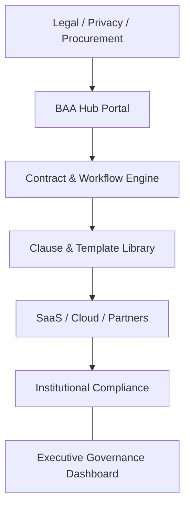

### 2. Detailed Platform Topology
The internal service boundaries and management layers of the industrialized BAA platform.

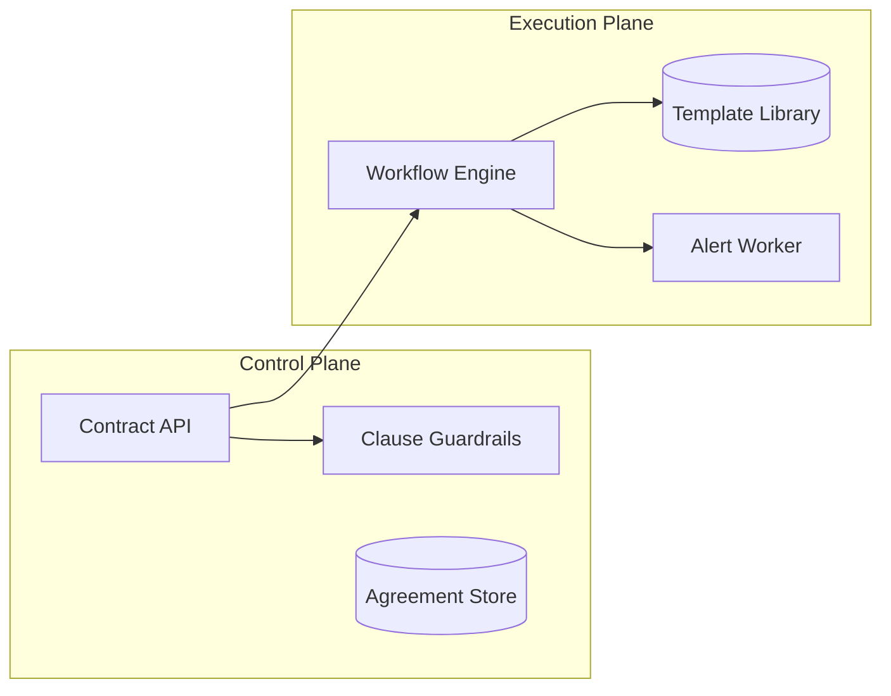

### 3. Intake Request to Signature Path
Tracing the path from a new vendor request to a fully executed and audited BAA.

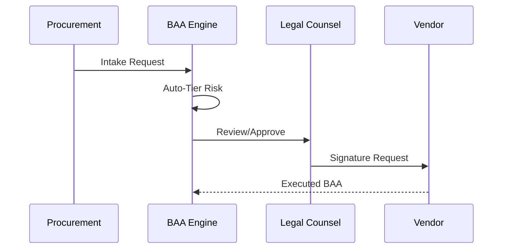

### 4. Contract Control Plane
The "Brain" of the framework managing global institutional BAA standards and automated validation workflows.

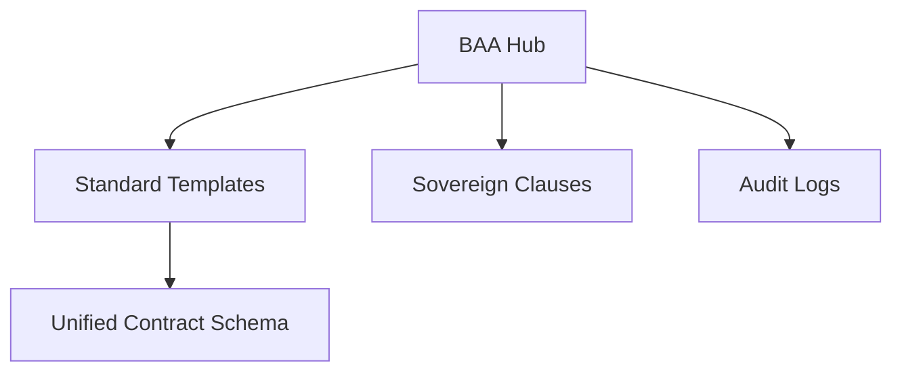

### 5. Multi-Cloud Topology
Synchronizing contract governance across Azure, AWS, and GCP for a unified institutional healthcare perimeter.

```mermaid
graph LR
    Azure[Azure BAA] <-> Bridge[BAA Hub] <-> AWS[AWS BAA]
    Bridge <-> GCP[GCP BAA]
```

### 6. Regional Deployment Model
Hosting governance nodes close to regional legal entities for localized compliance and high-performance access.

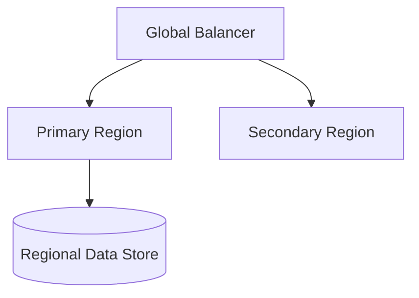

### 7. DR Failover Model
Ensuring platform continuity for critical healthcare legal and compliance workflows.

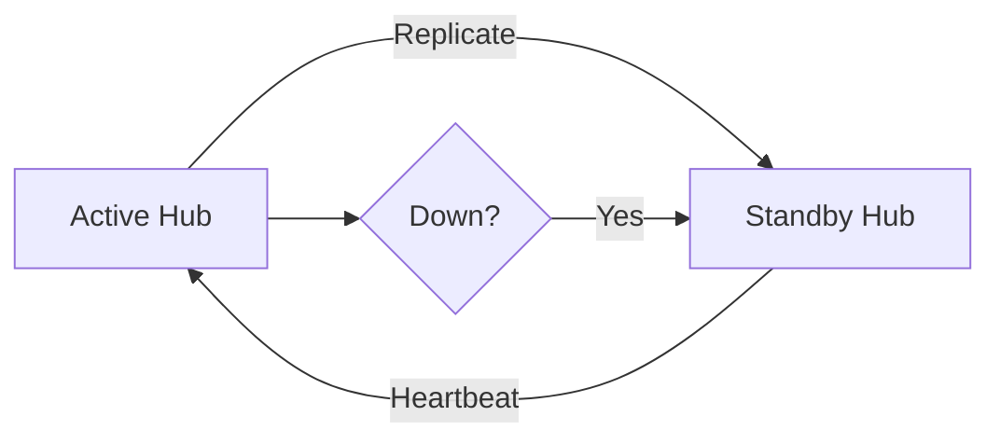

### 8. API Gateway Architecture
Securing and throttling the entry point for contract metadata and workflow updates.

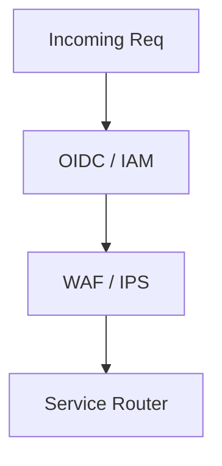

### 9. Queue Worker Architecture
Managing long-running document generation, mass renewal alerts, and integration syncs.

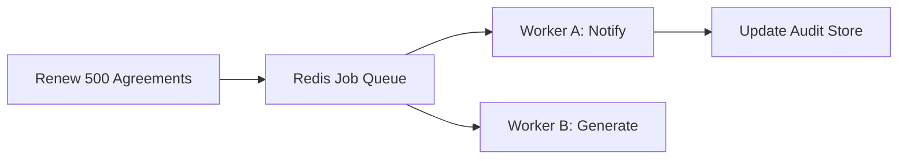

### 10. Dashboard Analytics Flow
How raw contract telemetry becomes executive institutional readiness and risk heatmaps.

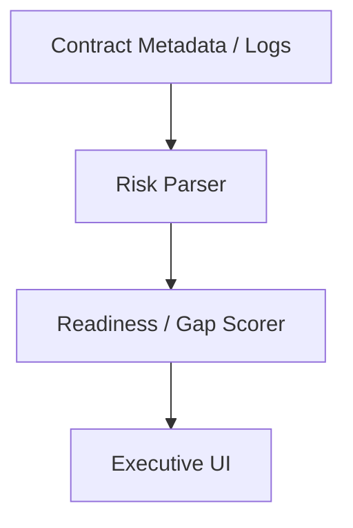

### 11. Vendor Intake Workflow
The standardized entry point for all new vendor BAA requests.

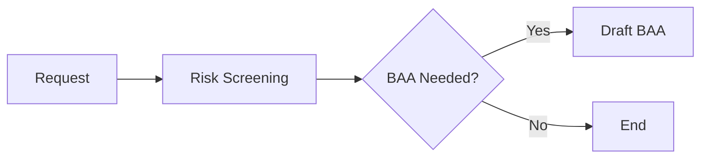

### 12. BAA Applicability Decision Tree
Automatically determining if a BAA is required based on PHI access.

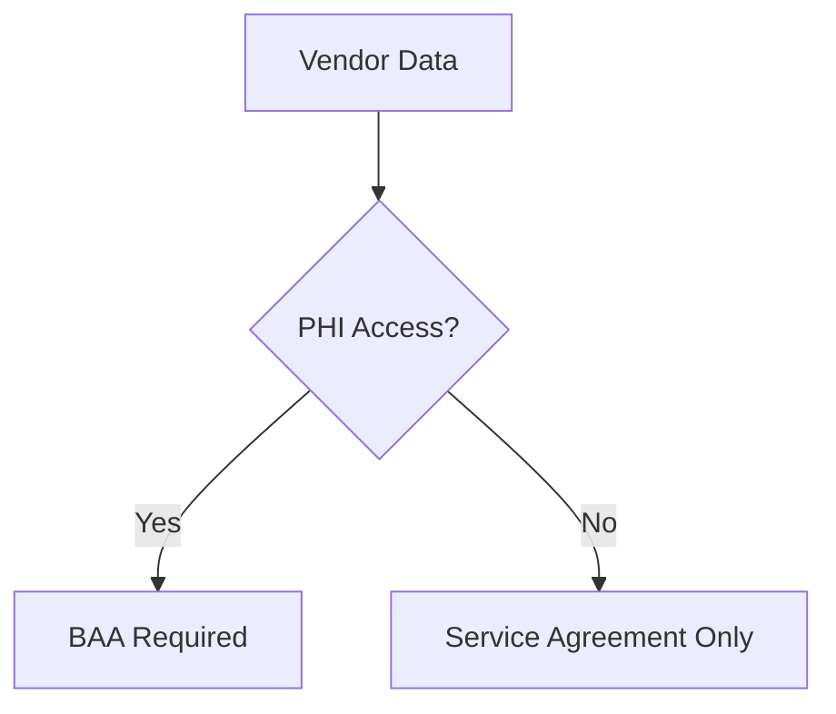

### 13. Tiering Assessment Model
Classifying vendors into risk tiers (High, Medium, Low) for proportional governance.

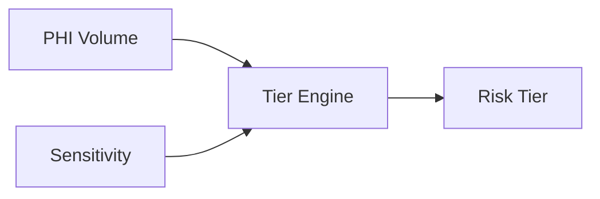

### 14. Legal Approval Flow
The multi-level legal review process for non-standard BAA clauses.

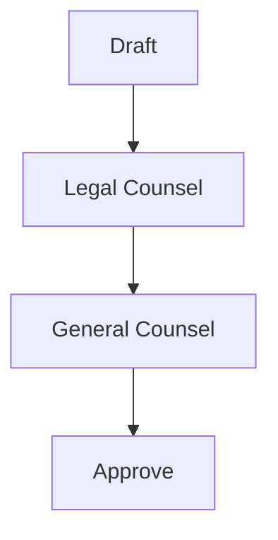

### 15. Privacy Review Process
Auditing BAA clauses against institutional privacy policies and HIPAA mandates.

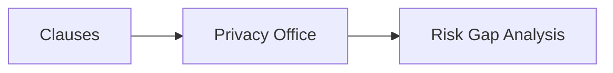

### 16. Security Review Process
Ensuring the technical safeguards in the BAA align with the vendor's actual security posture.

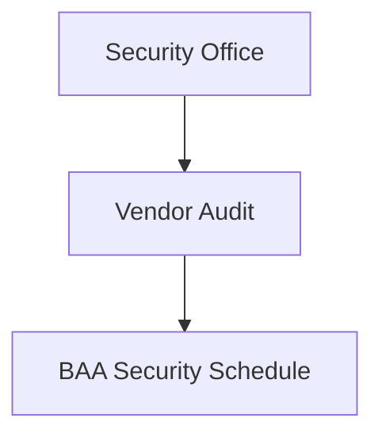

### 17. Signature Workflow
Orchestrating the digital signature process between institutional leaders and vendor executives.

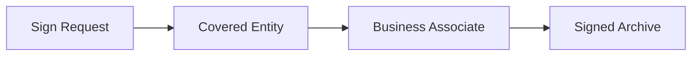

### 18. Renewal Lifecycle
Automating the identification and execution of BAA renewals before expiration.

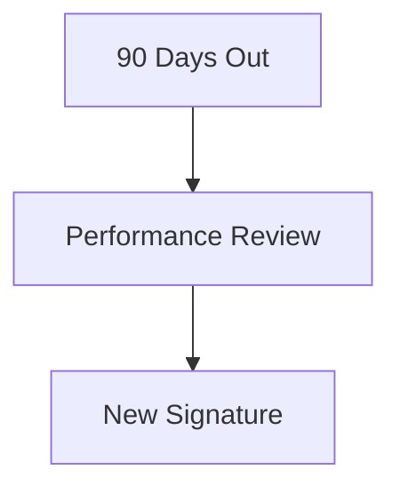

### 19. Amendment process model
Governing changes to active BAAs as services or regulations evolve.

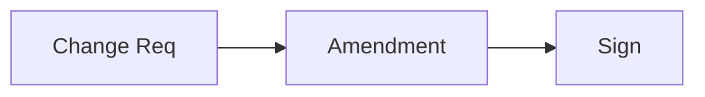

### 20. Continuous update workflow
Ensuring the template library stays aligned with new HIPAA OCR guidance or case law.

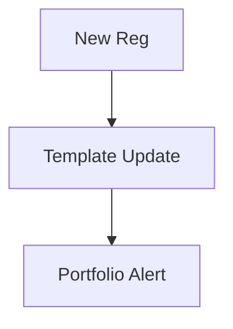

### 21. Covered entity relationship model
Visualizing the primary relationship between the provider/payer and their vendors.

```mermaid
graph LR
    CE[Hospital] --- BA[Cloud Provider]
```

### 22. Business associate chain model
Tracing the chain of trust through multiple layers of vendors and subcontractors.

```mermaid
graph LR
    CE[CE] --> BA[BA] --> SubBA[Subcontractor]
```

### 23. Subcontractor flow-down model
Enforcing that all HIPAA obligations "flow down" to every entity in the chain.

```mermaid
graph TD
    BAA_1[CE-BA BAA] --> BAA_2[BA-Sub BAA]
```

### 24. Minimum necessary workflow
Enforcing the "Minimum Necessary" rule for data access within BAA clauses.

```mermaid
graph LR
    Svc[Service] --> Min[Minimum PHI] --> Clause[BAA Clause]
```

### 25. Safeguards mapping model
Mapping BAA requirements to administrative, physical, and technical safeguards.

```mermaid
graph TD
    Req[BAA Req] --> Admin[Admin] & Phys[Physical] & Tech[Technical]
```

### 26. Breach notification workflow
Codifying the timeline and process for vendor-initiated breach notifications.

```mermaid
graph LR
    Detect[Detect] --> Notify[24h Alert] --> Report[Formal Report]
```

### 27. Access management model
Governing vendor access to PHI through codified BAA restrictions.

```mermaid
graph TD
    BA[Vendor] --> Hub[Auth Hub] --> Data[PHI]
```

### 28. Data retention governance
Defining how long vendors keep data and how they return/destroy it post-contract.

```mermaid
graph LR
    End[Term End] --> Destroy[Certified Purge] --> Evidence[Cert of Destruction]
```

### 29. PHI use/disclosure workflow
Restricting vendor use of PHI to specifically authorized service purposes.

```mermaid
graph TD
    Data[PHI] --> Use{Authorized?} --> Result[Allow/Deny]
```

### 30. Right to audit model
Managing the institutional right to physically or technically audit the business associate.

```mermaid
graph LR
    Req[Audit Req] --> Schedule[On-site] --> Findings[Remediation]
```

### 31. Vendor onboarding lifecycle
The end-to-end journey from vendor selection to BAA execution.

```mermaid
graph TD
    Select[Selection] --> BAA[BAA Flow] --> Active[Active Service]
```

### 32. Security questionnaire flow
Integrating technical risk assessments with the BAA legal workflow.

```mermaid
graph LR
    Q[Quest] --> Resp[Vendor Resp] --> Score[Risk Score]
```

### 33. Evidence request model
Requesting and storing vendor SOC2, HITRUST, or ISO certifications as BAA evidence.

```mermaid
graph TD
    Req[Evidence Req] --> Store[Audit Vault]
```

### 34. SOC2 / HITRUST review path
The process for auditing third-party assurance reports against BAA requirements.

```mermaid
graph LR
    Report[SOC2] --> Audit[Gap Review] --> Accept[Risk Signoff]
```

### 35. Remediation tracking workflow
Tracking the closure of security gaps identified during the BAA review process.

```mermaid
graph TD
    Gap[Gap] --> Action[Remediate] --> Verify[Close]
```

### 36. High-risk vendor escalation
Managing vendors who refuse standard BAA terms or have significant security gaps.

```mermaid
graph LR
    Esc[Escalate] --> CISO[CISO] --> Legal[Legal] --> Risk[Risk Acceptance]
```

### 37. Cloud provider BAA model
Specific governance patterns for hyperscalers (Azure, AWS, GCP) and their standard BAAs.

```mermaid
graph TD
    Cloud[AWS/Azure] --- Std[Enterprise BAA]
```

### 38. Telehealth partner governance
Securing the real-time communication and data handling of telehealth vendors.

```mermaid
graph LR
    Video[Video Stream] --> Enc[AES256 BAA Req]
```

### 39. Analytics processor review
Governing high-volume data processors and AI model providers.

```mermaid
graph TD
    Data[Bulk PHI] --> Proc[Analytics BAA]
```

### 40. Offboarding workflow
Ensuring clean data destruction and access revocation at contract termination.

```mermaid
graph LR
    Off[Offboard] --> Purge[Data Purge] --> Revoke[Access]
```

### 41. Clause library architecture
The structured taxonomy of institutional BAA clauses and fallback options.

```mermaid
graph TD
    Lib[Library] --> Breach[Breach Clauses] --> Indem[Indemnity]
```

### 42. Fallback clause matrix
The "If-Then" logic for legal negotiations when vendors reject standard terms.

```mermaid
graph LR
    Reject[Standard Rejected] --> Fallback[Tier 2 Clause]
```

### 43. Redline negotiation workflow
Managing the versioning and review of redlined BAA documents.

```mermaid
graph TD
    V1[Draft] --> Redline[Vendor Redline] --> Review[Counsel]
```

### 44. Version control model
Tracing the evolution of institutional BAA templates over time.

```mermaid
graph LR
    v2024[v2024 Template] --> v2025[v2025 AI-Ready]
```

### 45. Jurisdiction variant workflow
Managing state-specific privacy addendums (e.g., CCPA/CPRA, Texas HB 300).

```mermaid
graph TD
    Base[HIPAA BAA] --> State[Texas Addendum]
```

### 46. Insurance requirement flow
Validating that vendor cyber insurance meets BAA liability thresholds.

```mermaid
graph LR
    Policy[Insurance] --> Check[Limit Check] --> Pass[Approve]
```

### 47. SLA attachment model
Linking BAA breach notification timelines to technical Service Level Agreements.

```mermaid
graph TD
    SLA[Response SLA] --- BAA[Breach Clause]
```

### 48. Data return/destruction model
Codifying the specific method (Return or Destroy) for PHI at end of term.

```mermaid
graph LR
    Method{Method?} --> Return[Secure SFTP]
    Method --> Destroy[Certified Wipe]
```

### 49. Indemnity option matrix
Selecting the appropriate indemnity model based on vendor risk profile.

```mermaid
graph TD
    High[Uncapped] --- Med[Limited] --- Low[Standard]
```

### 50. Signature authority workflow
Validating that the signatory has the organizational authority to bind the entity.

```mermaid
graph LR
    Sign[Sign] --> Verify[Authority Check]
```

### 51. OIDC / SSO auth flow
Securing the BAA platform with institutional identity and MFA.

```mermaid
graph TD
    User[Legal] --> Okta[SSO] --> Platform[BAA Hub]
```

### 52. RBAC Model
Defining who can create templates, review BAAs, or sign agreements.

```mermaid
graph LR
    Role[Auditor] --> ReadOnly[View Only]
```

### 53. Encryption key lifecycle
Managing the keys used to encrypt sensitive contract documents and PII.

```mermaid
graph TD
    Key[KMS Key] --> Rotate[Auto Rotation]
```

### 54. Secrets management workflow
Securing API keys for integrations (Docusign, Jira, etc.).

```mermaid
graph LR
    Platform[BAA Hub] --> Vault[Vault] --> Key[Docusign Key]
```

### 55. Audit logging architecture
Capturing every template change, signature event, and risk assessment.

```mermaid
graph TD
    Event[Clause Change] --> Log[Immutable SIEM Log]
```

### 56. Metrics pipeline
The automated flow for capturing, processing, and storing governance KPIs.

```mermaid
graph LR
    Metric[Time to Sign] --> Agg[Aggregator] --> Dash[UI]
```

### 57. Logging architecture
The multi-layered approach to capturing logs from the BAA engine and workers.

```mermaid
graph TD
    Logs[App Logs] --> Sink[ELK/Sentinel]
```

### 58. Tracing model
Observing the full end-to-end path of a BAA request across microservices.

```mermaid
graph LR
    Trace[Req Trace] --> Engine --> Worker --> Docusign
```

### 59. Incident Response workflow
The process for handling potential data breaches involving the BAA platform itself.

```mermaid
graph TD
    Alert[Alert] --> Triage[Triage] --> Contain[Contain]
```

### 60. Breach coordination workflow
Managing the joint response with a vendor after a PHI breach is reported.

```mermaid
graph LR
    Report[Vendor Report] --> Bridge[Crisis Bridge] --> Notify[OCR]
```

### 61. Executive KPI review cycle
Providing the C-Suite with a unified view of third-party risk and compliance.

```mermaid
graph LR
    KPI[Coverage] --> Review[Quarterly Meeting]
```

### 62. Contract completion scorecard
Benchmarking the efficiency of the legal and procurement teams.

```mermaid
graph TD
    Goal[14 Days] <-> Actual[18 Days]
```

### 63. Risk heatmap model
Visualizing the concentration of vendor risk across departments and services.

```mermaid
graph LR
    Heat[Risk Heatmap] --> Action[Audit Prioritization]
```

### 64. Vendor benchmark comparison
Comparing the compliance posture and responsiveness of different vendors.

```mermaid
graph TD
    Best[Vendor A] --- Worst[Vendor B]
```

### 65. Renewal dashboard
Tracking upcoming contract expirations and their associated risk levels.

```mermaid
graph LR
    Renew[Renewals] --> Dash[Renewal Board]
```

### 66. Monthly reporting workflow
Automating the generation of compliance reports for internal stakeholders.

```mermaid
graph TD
    Data[Data] --> Report[PDF Gen] --> Email[Stakeholder]
```

### 67. Board reporting model
The executive communication path for significant third-party digital risks.

```mermaid
graph LR
    CPO[CPO] --> Board[Board Meeting]
```

### 68. PMO operating cadence
The institutional rhythm for managing the BAA platform roadmap and backlog.

```mermaid
graph TD
    Sprint[Sprint] --> Review[Demo]
```

### 69. Third-party maturity roadmap
The journey from "Basic Document Storage" to "Autonomous AI Governance."

```mermaid
graph LR
    Crawl[Manual] --> Run[Automated]
```

### 70. Continuous improvement loop
Evolving templates and workflows based on audit findings and legal feedback.

```mermaid
graph TD
    Audit[Audit] --> Lesson[Learn] --> Update[Update]
```

### 71. AI clause assistant flow
Utilizing LLMs to draft, review, and flag high-risk clauses in vendor redlines.

```mermaid
graph LR
    Doc[Doc] --> AI[AI Agent] --> Flag[Gaps]
```

### 72. Autonomous evidence engine
Automatically collecting and verifying vendor SOC2/HITRUST status from third-party portals.

```mermaid
graph TD
    Scan[Scan] --> Verify[Check Status] --> Alert[Stale Evidence]
```

### 73. Multi-country operating model
Governing cross-border healthcare data processing agreements (e.g., HIPAA + GDPR).

```mermaid
graph LR
    USA[HIPAA] <-> EU[GDPR]
```

### 74. Cross-border processor model
Managing the specific risks of data processing in diverse geographical regions.

```mermaid
graph TD
    Data[PHI] --> Region[EU/ASIA] --> BAA[Addendum]
```

### 75. Sovereign health data model
Ensuring data residency requirements are codified in the BAA legal framework.

```mermaid
graph LR
    Cloud[Cloud] --> Local[Sovereign Zone]
```

### 76. Carbon + vendor optimization
Integrating ESG and sustainability metrics into the vendor selection and BAA process.

```mermaid
graph TD
    Metric[Carbon] --- Risk[HIPAA Risk]
```

### 77. Self-service vendor portal
Enabling vendors to submit BAA drafts and evidence directly to the institution.

```mermaid
graph LR
    Vendor[Vendor] --> Portal[Self-Service]
```

### 78. Real-time obligation tracking
Monitoring ongoing BAA obligations (e.g., annual audits) in real-time.

```mermaid
graph TD
    Track[Tracker] --> Alert[Overdue Audit]
```

### 79. Innovation portfolio roadmap
Planning the next 36 months of platform evolution (AI, Blockchain, etc.).

```mermaid
graph LR
    Year1[Auto Gen] --> Year3[AI Agent]
```

### 80. Strategic transformation timeline
The executive view of the journey towards industrialized contract excellence.

```mermaid
graph TD
    Start[Basics] --> Future[AI-First]
```

### 81. Terraform demo environment flow
Automating the creation of isolated test environments for BAA workflow testing.

```mermaid
graph LR
    Code[TF] --> Env[Dev Env]
```

### 82. Queue processing lifecycle
Ensuring high-availability for background signature and reminder jobs.

```mermaid
graph TD
    Task[Task] --> Worker[Worker] --> Success[Ack]
```

### 83. Backup recovery model
Governing the protection and testing of historical BAA and audit data.

```mermaid
graph LR
    Active[Active] --> Snap[Snap] --> Test[Monthly]
```

### 84. CMDB sync model
Synchronizing the BAA platform with the institutional Configuration Management Database.

```mermaid
graph TD
    BAA[BAA Hub] <-> CMDB[Asset Inventory]
```

### 85. Vendor inventory lifecycle
Managing the creation, update, and deactivation of vendor profiles.

```mermaid
graph LR
    Add[Add Vendor] --> Audit[Governance] --> Retire[Retire]
```

### 86. Tenant baseline comparison
Auditing individual department portfolios against the institutional gold-standard BAA.

```mermaid
graph TD
    Gold[Standard] <-> Dept[Radiology BAA]
```

### 87. KPI data lineage model
Tracing dashboard metrics back to the specific BAA audit log events.

```mermaid
graph LR
    Metric[Score] --- Audit[Event Log]
```

### 88. Obligation tracker flow
Managing the specific "To-Do" items created by BAA clauses (e.g., training, audits).

```mermaid
graph TD
    Clause[Clause] --> Oblig[Obligation] --> Track[Owner]
```

### 89. Retention schedule automation
Automatically purging or archiving BAAs based on institutional retention policies.

```mermaid
graph LR
    Data[BAA] --> Schedule[7 Years] --> Purge[Auto]
```

### 90. Global vendor hub model
Centralizing vendor governance for multi-national healthcare systems.

```mermaid
graph TD
    Hub[Global Hub] --- Regional[Reg Office]
```

### 91. Counsel escalation workflow
Managing the path to specialized legal counsel for high-complexity BAA negotiations.

```mermaid
graph LR
    Issue[Complex Issue] --> Expert[Privacy Counsel]
```

### 92. Supplier assurance workflow
Integrating BAA execution with broader supplier risk management (TPRM).

```mermaid
graph TD
    TPRM[TPRM Flow] --- BAA[BAA Flow]
```

### 93. Regional benchmark comparison
Comparing BAA completion metrics across different regional health networks.

```mermaid
graph TD
    RegA[95%] --- RegB[70%]
```

### 94. Legal hold process
Ensuring that BAAs subject to litigation are preserved and not purged.

```mermaid
graph LR
    Hold[Legal Hold] --> Freeze[Data Freeze]
```

### 95. Data residency review path
Validating that PHI processing locations align with BAA geographical restrictions.

```mermaid
graph TD
    Loc[Location] --> Verify[Cloud Audit] --> BAA[Compliance]
```

---

## 🔬 BAA Governance Methodology

### 1. The BAA Pillars
Our platform is built on four core pillars:
- **Assurance**: Ensuring 100% contract coverage for all entities handling PHI.
- **Velocity**: Accelerating the digital health innovation cycle through automated legal workflows.
- **Risk**: Quantifying and mitigating third-party risk through data-driven assessments.
- **Audit**: Maintaining institutional peace of mind with 24/7 audit readiness.

### 2. Strategic Transformation Framework
We provide a strategic framework for transitioning the organization from "Paper-Based Contracting" to "Industrialized Digital Trust."

---

## 🚦 Getting Started

### 1. Prerequisites
- **Python 3.10+**
- **Docker & Docker Compose**
- **PostgreSQL** (local or cloud)

### 2. Local Setup
```bash
# Clone the repository
git clone https://github.com/Devopstrio/hipaa-baa-templates.git
cd hipaa-baa-templates

# Start the Platform
docker-compose up --build
```
Access the Portal at `http://localhost:3000`.

---

## 🛡️ Governance & Security
- **Document Integrity**: Automated SHA256 hashing for all template versions and signed agreements.
- **Institutional RBAC**: Granular access control for legal, privacy, and procurement teams.
- **Audit Ready**: Built-in evidence generation for HIPAA OCR and internal audits.

---
<sub>&copy; 2026 Devopstrio &mdash; Engineering the Future of Healthcare Digital Trust.</sub>
