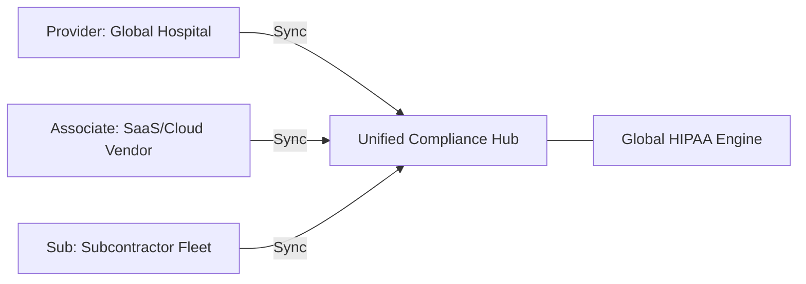
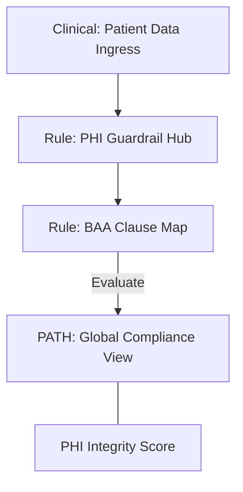
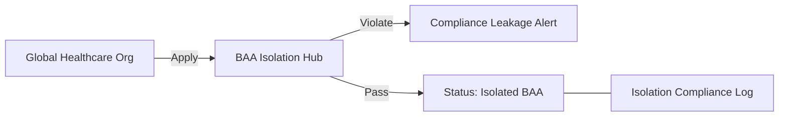
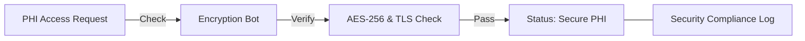
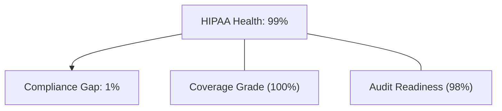
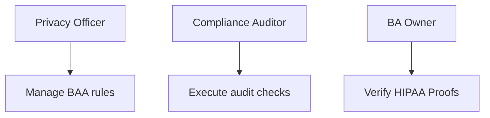
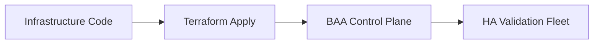
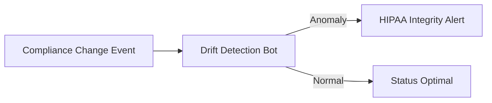
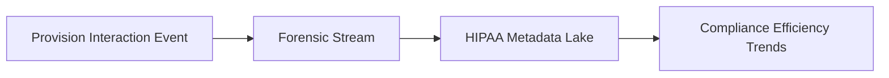

<div align="center">


<h1>HIPAA BAA Templates</h1>

<p><strong>The Institutional-Grade Platform for Healthcare Business Associate Agreement (BAA) Governance, PHI Guardrail Orchestration, and Compliance Automation.</strong></p>

[]()
[]()
[]()

<br/>

> **"Industrializing healthcare vendor contracting to secure PHI."** 
> **HIPAA BAA Templates** is an enterprise-grade platform designed to provide a secure, measurable, and highly automated foundation for global healthcare compliance operations. It orchestrates the complex lifecycle of BAA governance—from multi-cloud template provisioning and PHI guardrail enforcement to distributed clause synchronization and unified compliance auditing.

</div>

---

## 🏛️ Executive Summary

Fragmented contract silos and manual BAA negotiations are strategic operational liabilities; lack of centralized compliance orchestration is a primary barrier to organizational healthcare maturity. Organizations fail to maintain a secure HIPAA foundation not because of a lack of templates, but because of fragmented governance standards, lack of automated clause validation, and an inability to orchestrate compliance landing zones with operational precision.

This platform provides the **HIPAA BAA Intelligence Plane**. It implements a complete **Enterprise BAA-as-Code Framework**, enabling Privacy and Compliance teams to manage global healthcare agreements as first-class citizens. By automating the identification of compliance bottlenecks through real-time telemetry analysis and orchestrating the deployment of secure PHI guardrails, we ensure that every organizational vendor—from core cloud providers to distributed SaaS tools—is governed by default, audited for history, and strictly aligned with institutional HIPAA frameworks.

---

## 📐 Architecture Storytelling: Principal Reference Models

### 1. Principal Architecture: Global HIPAA BAA Governance & Intelligence Plane
This diagram illustrates the end-to-end flow from multi-cloud template ingestion and BAA orchestration to PHI guardrail enforcement, security validation, and institutional compliance auditing.


```mermaid
graph LR
    %% Subgraph Definitions
    subgraph TemplateIngress["Hybrid & Multi-Cloud Ingress"]
        direction TB
        Healthcare_Providers["Hospitals / Clinicians / Payers"]
        Business_Associates["SaaS / Cloud / IT Vendors"]
        Compliance_Templates["OCR / Legal BAA Frameworks"]
    end

    subgraph IntelligenceEngine["Compliance Intelligence Hub"]
        direction TB
        API["FastAPI BAA Gateway"]
        BAAOrchestrator["BAA Lifecycle & Clause Orch"]
        PHIGuardrail_Hub["PHI Guardrail & Control Hub"]
        RiskValidator["AIOps Compliance Risk Hub"]
    end

    subgraph OperationsPlane["Distributed Compliance Fleet"]
        direction TB
        BAAWorkers["JIT & Lifecycle BAA Provisioners"]
        PHIGateways["Secure PHI Access Gateways"]
        AuditProxies["Forensic Audit & Review Proxies"]
    end

    subgraph OperationsHub["Institutional Compliance Hub"]
        direction TB
        Scorecard["HIPAA Maturity Scorecard"]
        Analytics["Clause Velocity & Gap Stats"]
        Audit["Forensic HIPAA Metadata Lake"]
    end

    subgraph DevOps["BAA-as-Code Framework"]
        direction TB
        TF["Terraform Compliance Modules"]
        DriftBot["Clause & Template Drift Validator"]
        ChatOps["Compliance Operations Hub"]
    end

    %% Flow Arrows
    TemplateIngress -->|1. Submit BAA Request| API
    API -->|2. Orchestrate BAA| BAAOrchestrator
    BAAOrchestrator -->|3. Apply PHI Policy| PHIGuardrail_Hub
    PHIGuardrail_Hub -->|4. Assess Risk| RiskValidator
    
    RiskValidator -->|5. Execute Provision| OperationsPlane
    OperationsPlane -->|6. Notify Status| ChatOps
    API -->|7. Visualize Health| Scorecard
    
    Scorecard -->|8. Track Maturity| Analytics
    Scorecard -->|9. Record Provision| Audit
    
    TF -->|10. Provision Backbone| IntelligenceEngine
    DriftBot -->|11. Inject Clause Risk| BAAOrchestrator
    Audit -->|12. Improve Compliance| BAAWorkers

    %% Styling
    classDef ingress fill:#f5f5f5,stroke:#616161,stroke-width:2px;
    classDef intel fill:#e8eaf6,stroke:#1a237e,stroke-width:2px;
    classDef operations fill:#e1f5fe,stroke:#01579b,stroke-width:2px;
    classDef ops fill:#ede7f6,stroke:#311b92,stroke-width:2px;
    classDef devops fill:#e8f5e9,stroke:#1b5e20,stroke-width:2px;

    class TemplateIngress ingress;
    class IntelligenceEngine intel;
    class OperationsPlane operations;
    class OperationsHub ops;
    class DevOps devops;
```

### 2. The BAA Lifecycle Flow
The continuous path of a HIPAA BAA from initial draft (template) and negotiation (legal) to active signature (OIDC/SAML), audit (metadata), and institutional forensic auditing.


```mermaid
graph LR
    Draft["Draft (Template)"] --> Negotiate["Negotiate (Legal)"]
    Negotiate --> Sign["Sign (Auth)"]
    Sign --> Audit["Audit & Renew"]
```

### 3. Distributed HIPAA Compliance Topology
Strategically orchestrating BAA governance across healthcare providers, business associates, and subcontractors, providing a unified institutional view of global HIPAA health and compliance readiness.


```mermaid
graph LR
    Provider["Provider: Global Hospital"] -->|Sync| Hub["Unified Compliance Hub"]
    Associate["Associate: SaaS/Cloud Vendor"] -->|Sync| Hub
    Sub["Sub: Subcontractor Fleet"] -->|Sync| Hub
    Hub --- Logic["Global HIPAA Engine"]
```

### 4. PHI (Protected Health Information) Guardrail & Control Flow
Executing complex logic for securing the bridge between clinical data and BAA enforcement, ensuring every organizational identity is verified and every PHI access is according to institutional standards.


```mermaid
graph TD
    Clinical["Clinical: Patient Data Ingress"] --> Bridge["Rule: PHI Guardrail Hub"]
    Bridge --> BAA["Rule: BAA Clause Map"]
    BAA -->|Evaluate| Context["PATH: Global Compliance View"]
    Context --- Estimate["PHI Integrity Score"]
```

### 5. Multi-Tenant BAA Isolation & Governance Flow
Automatically managing BAA isolation and cross-entity compliance for global healthcare conglomerates, ensuring institutional data residency and security boundaries by default.


```mermaid
graph LR
    Org["Global Healthcare Org"] -->|Apply| Guard["BAA Isolation Hub"]
    Guard -->|Violate| Alert["Compliance Leakage Alert"]
    Guard -->|Pass| Verify["Status: Isolated BAA"]
    Verify --- Audit["Isolation Compliance Log"]
```

### 6. Encryption & Data Protection Flow (BAA Standard)
Managing the lifecycle of a PHI request, automatically enforcing institutional encryption standards for PHI at rest and in transit as required by BAA, ensuring zero-latency security confidence.


```mermaid
graph LR
    PHI["PHI Access Request"] -->|Check| Gatekeeper["Encryption Bot"]
    Gatekeeper -->|Verify| AES["AES-256 & TLS Check"]
    AES -->|Pass| Admit["Status: Secure PHI"]
    Admit --- Audit["Security Compliance Log"]
```

### 7. Institutional HIPAA Maturity Scorecard
Grading organizational performance based on key indicators: BAA Coverage Grade, Audit Readiness Index, and Incident Response Velocity.


```mermaid
graph TD
    Post["HIPAA Health: 99%"] --> Risk["Compliance Gap: 1%"]
    Post --- C1["Coverage Grade (100%)"]
    Post --- C2["Audit Readiness (98%)"]
```

### 8. Identity & RBAC for BAA Governance
Managing fine-grained access to compliance hubs, provisioning workers, and audit logs between Privacy Officers, Compliance Auditors, and Business Associate Owners.


```mermaid
graph TD
    Privacy["Privacy Officer"] --> Hub["Manage BAA rules"]
    Auditor["Compliance Auditor"] --> Exec["Execute audit checks"]
    Owner["BA Owner"] --> Audit["Verify HIPAA Proofs"]
```

### 9. IaC Deployment: BAA-as-Code Framework
Using modular Terraform to deploy and manage the versioned distribution of the compliance tracking hubs, PHI guardrail workers, and forensic metadata lakes.


```mermaid
graph LR
    HCL["Infrastructure Code"] --> TF["Terraform Apply"]
    TF --> Engine["BAA Control Plane"]
    Engine --> Clusters["HA Validation Fleet"]
```

### 10. AIOps Compliance Drift & Risk Validation Flow
Using advanced analytics to identify sudden surges in BAA violations, suspicious PHI access patterns, suspicious configuration drifts, or unusual compliance pattern changes that could result in institutional risk.


```mermaid
graph LR
    Drift["Compliance Change Event"] --> Analyzer["Drift Detection Bot"]
    Analyzer -->|Anomaly| Alert["HIPAA Integrity Alert"]
    Analyzer -->|Normal| Pass["Status Optimal"]
```

### 11. Metadata Lake for Forensic HIPAA Audit
Storing long-term records of every BAA signed, every clause changed, and every audit request event for institutional record-keeping, compliance auditing, and post-provisioning forensics.


```mermaid
graph LR
    Provision["Provision Interaction Event"] --> Stream["Forensic Stream"]
    Stream --> Lake["HIPAA Metadata Lake"]
    Lake --> Trends["Compliance Efficiency Trends"]
```

---

## 🏛️ Core Governance Pillars

1.  **Unified Foundation Coordination**: Maximizing resilience by centralizing all HIPAA measurement through a single institutional plane.
2.  **Automated BAA Provisioning**: Eliminating "manual template" scenarios through proactive orchestration and pattern verification.
3.  **Sequential PHI Intelligence**: Ensuring zero-interruption operations through dependency-aware clinical data engineering.
4.  **Zero-Trust Compliance Protection**: Automatically enforcing identity-based access and rule evaluation across all BAA tiers.
5.  **Autonomous Operations Logic**: Guaranteeing reliability through automated industry-specific HIPAA monitoring runbooks.
6.  **Full BAA Auditability**: Immutable recording of every clause change and BAA provision for institutional forensics.

---

## 🛠️ Technical Stack & Implementation

### Compliance Engine & APIs
*   **Framework**: Python 3.11+ / FastAPI.
*   **BAA Engine**: Custom Python-based logic for multi-cloud template provisioning and DORA-style compliance metrics.
*   **Integrations**: Native connectors for OCR Guidance, Docusign, Azure Key Vault, and AWS KMS APIs.
*   **Persistence**: PostgreSQL (Compliance Ledger) and Redis (Live HIPAA State).
*   **Auth Orchestrator**: Federated OIDC/SAML for least-privilege compliance management access.

### Governance Dashboard (UI)
*   **Framework**: React 18 / Vite.
*   **Theme**: Dark, Teal, Indigo (Modern high-fidelity healthcare aesthetic).
*   **Visualization**: D3.js for BAA topologies and Recharts for compliance velocity analytics.

### Infrastructure & DevOps
*   **Runtime**: AWS EKS or Azure Kubernetes Service (AKS) for management plane.
*   **Compliance Hub**: Managed event sourcing for immutable HIPAA security timeline reconstruction.
*   **IaC**: Modular Terraform for deploying the HIPAA landing zone and validation fleet.

---

## 🏗️ IaC Mapping (Module Structure)

| Module | Purpose | Real Services |
| :--- | :--- | :--- |
| **`infrastructure/baa_hub`** | Central management plane | EKS, PostgreSQL, Redis |
| **`infrastructure/guardrails`** | Distributed PHI provisioners | K8s Workers, Cloud APIs |
| **`infrastructure/connectors`** | BAA Clause Ingestion Hubs | Webhooks, Lambda |
| **`infrastructure/auditing`** | Forensic HIPAA sinks | S3, Athena, Quicksight |

---

## 🚀 Deployment Guide

### Local Principal Environment
```bash
# Clone the landing zone platform
git clone https://github.com/devopstrio/hipaa-baa-templates.git
cd hipaa-baa-templates

# Configure environment
cp .env.example .env

# Launch the HIPAA stack
make init

# Trigger a mock BAA provision and automated PHI guardrail validation simulation
make simulate-hipaa
```

Access the Management Portal at `http://localhost:3000`.

---

## 📜 License
Distributed under the MIT License. See `LICENSE` for more information.

---
<div align="center">
  <p>© 2026 Devopstrio. All rights reserved.</p>
</div>
